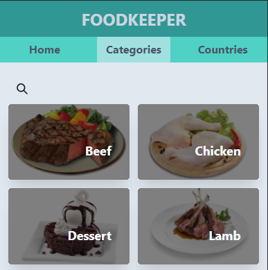

# Mounsters Hunter

> This is a web application where the user will be able to find different recipes of food around the world. The user can select by country or category. Besides, The user can filter the meal based on the name.

## :red_circle: Live Demo:

[Live Demo Link](https://food-peeker.netlify.app/)

## :hammer: Built with

- React
- Redux
- chakra-UI
- JavaScript
- Linters
- VS code

To get a local copy up and running follow these simple steps:

1. Go to the [repository page](https://github.com/kcotrinam/RPG_game_capstone).
2. Press the "Code" button and copy the link.
3. Clone it using git command `git clone <link>`.

## :construction_worker: How to use?

1. Move to the folder: `cd FoodPeeker`.
2. run `npm install`.
3. on your command line run: `npm start`.

## :construction_worker: How to run tests?

1. Move to the folder: `cd FoodPeeke`.
2. Run `npm run test`.

## :bust_in_silhouette: Author

👤 **Kevin Cotrina**

- GitHub: [kcotrinam](https://github.com/kcotrinam)
- Twitter: [@kcotrinam_dev](https://twitter.com/kcotrinam_dev)
- LinkedIn: [KevinCotrina](https://www.linkedin.com/in/kevincotrina/)

## 🤝 :raised_hand: :raised_hand: Contributions

Contributions, issues, and feature requests are welcome!

Feel free to check the [issues page](https://github.com/kcotrinam/RPG_game_capstone/issues).

## :muscle: Show your support

Give a ⭐️ if you like this project!

## :grey_exclamation: Acknowledgment

- [Microverse](https://www.microverse.org/)
- [Nelson Sakwa](https://www.behance.net/gallery/31579789/Ballhead-App-(Free-PSDs))
- [TheMealDB](https://www.themealdb.com/api.php)

## 📝 License

This project is [MIT](LICENSE) licensed.
